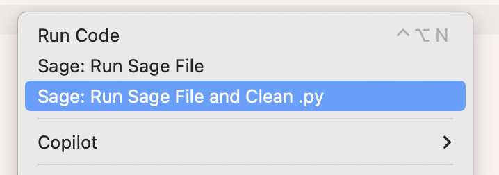

# SageMath VS Code Enhancement Plugin (sage-code)

Developed to streamline my personal workflow in CTF crypto challenges, this plugin improves the SageMath development experience in VS Code.

## ✨ Features

* **Enhanced Syntax Highlighting**

  * Recognizes SageMath-specific keywords, functions, and classes.
  * Correctly highlights ring definition syntax such as `R.<x> = ...`.

* **Basic Code Completion**

  * Automatically extracts symbols from the SageMath environment to provide completion suggestions.
  * Offers real-time suggestions to improve coding efficiency.

* **Hover Documentation**

  * Displays the docstring when hovering over SageMath functions or classes.
  * Uses `docutils` to convert RST-formatted docs into HTML for better readability.

* **Code Runner Integration**

  * Supports multiple execution modes for `.sage` files:

    * **Run normally:** Execute Sage scripts directly.
    * **Run and clean:** Execute and then automatically remove the generated `.py` files to keep the workspace clean.

## 📸 Preview

## 📄 License

This project is licensed under the [MIT License](./LICENSE).
